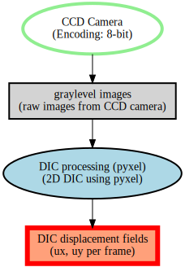

# Examples and recipes — from scratch vs registry

This page is a **cookbook / how-to guide**.
Use it when you already know the basics and want a practical script to adapt to your own workflow.

This page shows the **same pipeline** built in two ways:
1) **From scratch** (explicit creation of every item)
2) **Registry‑based** (reuse shared items and override only what changes)

For interactive usage, see **Notebooks (Marimo)**: [notebooks.md](notebooks.md).


## Example index
### Python scripts (`examples/python/`)
- {ghsrc}`examples/python/basic_create.py`: minimal end‑to‑end JSON generation.
- {ghsrc}`examples/python/complex_dic_pipeline.py`: from‑scratch DIC pipeline (detailed below).
- {ghsrc}`examples/python/complex_dic_pipeline_registry.py`: registry‑based DIC pipeline (detailed below).
- {ghsrc}`examples/python/create_registry_camera.py`: generate, validate, and save a new camera item directly into `registry/`.
- {ghsrc}`examples/python/graph_r3xa.py`: graph generator (Graphviz + PyVis).
- {ghsrc}`examples/python/load_edit_save.py`: load an existing R3XA file, edit it, and save it again.
- {ghsrc}`examples/python/qi_hu_from_json_literal.py`: literal Python reconstruction of the Qi Hu JSON payload.
- {ghsrc}`examples/python/registry_discovery.py`: list registry entries, merge one item, and save the merged result.
- {ghsrc}`examples/python/registry_usage.py`: minimal registry loading and override example.
- {ghsrc}`examples/python/typed_dic_pipeline.py`: typed/Pydantic version of the DIC pipeline.
- {ghsrc}`examples/python/qi_hu_from_scratch.py`: full Qi Hu case built from scratch with loops (see Qi Hu page for details).
- {ghsrc}`examples/python/validate_all.py`: validate all example JSON.
- {ghsrc}`examples/python/validate_examples.py`: quick validation of example files.

### MATLAB scripts (`examples/matlab/`)
- {ghsrc}`examples/matlab/qi_hu_from_scratch.m`: Qi Hu case built from scratch using the MATLAB binding.

### Data files
- `examples/valid_camera_list.json`: minimal valid camera dataset.
- `examples/valid_tabular_file.json`: minimal valid tabular dataset.
- `examples/artifacts/`: generated outputs (JSON + graphs) from scripts.

## 1) From scratch
Source: {ghsrc}`examples/python/complex_dic_pipeline.py`

Key ideas:
- Define specimen, camera, and DIC source explicitly.
- Generate file names and timestamps via loops.
- Build datasets directly from those lists.

```python
from r3xa_api import R3XAFile, unit

r3xa = R3XAFile(
    title="Open-hole tensile test with DIC",
    description="Camera acquisition + DIC processing pipeline",
    authors="R3XA API",
    date="2024-10-30",
)

specimen = r3xa.add_specimen_setting(
    title="Openhole sample",
    description="Glass-epoxy specimen",
    sizes=[
        unit(title="width", value=30.0, unit="mm", scale=1.0),
        unit(title="thickness", value=2.0, unit="mm", scale=1.0),
    ],
    patterning_technique="white background with black spray paint",
)

camera = r3xa.add_camera_source(
    title="CCD Camera",
    description="Encoding: 8-bit",
    output_components=1,
    output_dimension="surface",
    output_units=[unit(title="graylevel", value=1.0, unit="gl", scale=1.0)],
    manufacturer="Allied Vision Technologies (AVT)",
    model="Dolphin F-145B",
    image_size=[
        unit(title="width", value=1392, unit="px", scale=1.0),
        unit(title="height", value=1040, unit="px", scale=1.0),
    ],
    focal_length=unit(title="focal_length", value=25.0, unit="mm", scale=1.0),
    standoff_distance=unit(title="standoff", value=0.5, unit="m", scale=1.0),
)

num_frames = 5
image_files = [f"img_{i:04d}.tif" for i in range(num_frames)]
timestamps = [i * 0.5 for i in range(num_frames)]

images = r3xa.add_image_set_list(
    title="graylevel images",
    description="raw images from CCD camera",
    path="images/",
    file_type="image/tiff",
    data_sources=[camera["id"]],
    time_reference=unit(title="time_reference", value=0.0, unit="s", scale=1.0),
    timestamps=timestamps,
    data=image_files,
)

dic = r3xa.add_data_source(
    "data_sources/generic",
    title="DIC processing (pyxel)",
    description="2D DIC using pyxel",
    output_components=2,
    output_dimension="surface",
    output_units=[
        unit(title="ux", value=1.0, unit="mm", scale=1.0),
        unit(title="uy", value=1.0, unit="mm", scale=1.0),
    ],
    manufacturer="Pyxel",
    model="pyxel-2d",
    input_data_sets=[images["id"]],
)

dic_files = [f"dic_{i:04d}.csv" for i in range(num_frames)]

r3xa.add_image_set_list(
    title="DIC displacement fields",
    description="ux, uy per frame",
    path="dic/",
    file_type="text/csv",
    data_sources=[dic["id"]],
    time_reference=unit(title="time_reference", value=0.0, unit="s", scale=1.0),
    timestamps=timestamps,
    data=dic_files,
)
```

## 2) Registry‑based
Source: {ghsrc}`examples/python/complex_dic_pipeline_registry.py`

Key ideas:
- Load reusable items from `registry/`
- Validate each item **by kind**
- Override only what changes (IDs, experiment‑specific values)
- Use `RegistryItem.merge(...)` so the merge operation stays attached to the item itself

```python
from r3xa_api import R3XAFile, Registry, unit

registry = Registry("registry")

specimen_base = registry.get_item("settings/specimen/openhole_sample")
camera_base = registry.get_item("data_sources/camera/avt_dolphin_f145b")
pyxel_base = registry.get_item("data_sources/generic/pyxel_dic_2d")

specimen = specimen_base.merge(id="set_spec_exp01")
camera = camera_base.merge(
    id="ds_cam_exp01",
    description="CCD Camera (exp01)",
    standoff_distance=unit(title="standoff", value=0.5, unit="m", scale=1.0),
)

r3xa = R3XAFile(
    title="Open-hole tensile test with DIC (registry)",
    description="Camera acquisition + DIC processing pipeline (registry-based)",
    authors="R3XA API",
    date="2024-10-30",
)

r3xa.settings.append(specimen)
r3xa.data_sources.append(camera)

num_frames = 5
image_files = [f"img_{i:04d}.tif" for i in range(num_frames)]
timestamps = [i * 0.5 for i in range(num_frames)]

images = r3xa.add_image_set_list(
    title="graylevel images",
    description="raw images from CCD camera",
    path="images/",
    file_type="image/tiff",
    data_sources=[camera["id"]],
    time_reference=unit(title="time_reference", value=0.0, unit="s", scale=1.0),
    timestamps=timestamps,
    data=image_files,
)

dic = pyxel_base.merge(
    id="ds_dic_exp01",
    input_data_sets=[images["id"]],
)
r3xa.data_sources.append(dic)

dic_files = [f"dic_{i:04d}.csv" for i in range(num_frames)]
r3xa.add_image_set_list(
    title="DIC displacement fields",
    description="ux, uy per frame",
    path="dic/",
    file_type="text/csv",
    data_sources=[dic["id"]],
    time_reference=unit(title="time_reference", value=0.0, unit="s", scale=1.0),
    timestamps=timestamps,
    data=dic_files,
)
```

## Outputs
- From scratch: `examples/artifacts/dic_pipeline.json`
- Registry‑based: `examples/artifacts/dic_pipeline_registry.json`

## 3) Creating a new registry item
Source: {ghsrc}`examples/python/create_registry_camera.py`

Key ideas:
- build a single registry item with `new_item(...)`
- bind it to a registry key with `Registry.wrap(...)`
- validate and save it with `RegistryItem.save(...)`
- reload it through `Registry(...).get_item(...)`

This example writes:
- `registry/data_sources/camera/example_generated_camera.json`

Reusable registry key:
- `data_sources/camera/example_generated_camera`

Built-in registry templates worth knowing:
- `settings/generic/instron_5800`: generic testing-machine setting template.
- `data_sets/list/camera_images_template`: minimal camera image list template.
- `data_sets/file/tabular_timeseries_template`: minimal tabular time-series file template.

## 4) Loading an existing file and saving it again
Source: {ghsrc}`examples/python/load_edit_save.py`

Key ideas:
- load a full R3XA file with `R3XAFile.load(...)`
- update the header in place
- save a validated JSON file with `save(...)`

This example reads:
- `examples/artifacts/dic_pipeline.json`

This example writes:
- `examples/artifacts/dic_pipeline_loaded.json`

## 5) Discovering and merging registry items
Source: {ghsrc}`examples/python/registry_discovery.py`

Key ideas:
- discover available registry items with `Registry.list(...)`
- load an existing registry item with `Registry.get_item(...)`
- clone it with `RegistryItem.merge(...)`
- save the merged result with `RegistryItem.save(...)`

This example writes:
- `examples/artifacts/registry_camera_merged.json`

See also:
- {ghsrc}`examples/python/registry_usage.py` for the smaller `load_validated(...)` + `get_item(...)` workflow.
- `registry/data_sets/list/camera_images_template.json`
- `registry/data_sets/file/tabular_timeseries_template.json`
- `registry/settings/generic/instron_5800.json`

## 6) Typed DIC pipeline
Source: {ghsrc}`examples/python/typed_dic_pipeline.py`

Key ideas:
- install the optional `typed` extra
- build the same DIC pipeline using generated Pydantic models
- append typed objects directly into `R3XAFile`

This example writes:
- `examples/artifacts/dic_pipeline_typed.json`

## 7) Qi Hu from a literal JSON reconstruction
Source: {ghsrc}`examples/python/qi_hu_from_json_literal.py`

Key ideas:
- rebuild the Qi Hu document with explicit `add_setting(...)`, `add_data_source(...)`, and `add_data_set(...)` calls
- compare the generated file to the reference `qi_hu_from_scratch.json`
- use it as a literal baseline when validating future API changes

This example writes:
- `examples/artifacts/qi_hu_from_json_literal.json`

## DIC pipeline graph (from scratch example)
SVG (Graphviz backend):



Interactive HTML (PyVis backend):

<iframe
  src="graph_dic_pipeline.html"
  width="100%"
  height="700"
  style="border:1px solid #ddd;"
  title="DIC pipeline graph (interactive)"
></iframe>
