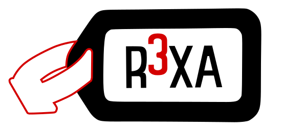

R3XA_API Documentation
======================

Credits and origin
------------------
- Initial implementation by **E. Roubin**, based on a shared specification led by **J‑C. Passieux**.
- Original repository: ``https://gitlab.com/photomecanics/r3xa``

.. toctree::
   :maxdepth: 2
   :caption: Contents

   overview.md
   api.md
   examples.md
   validation.md
   qi_case.md
