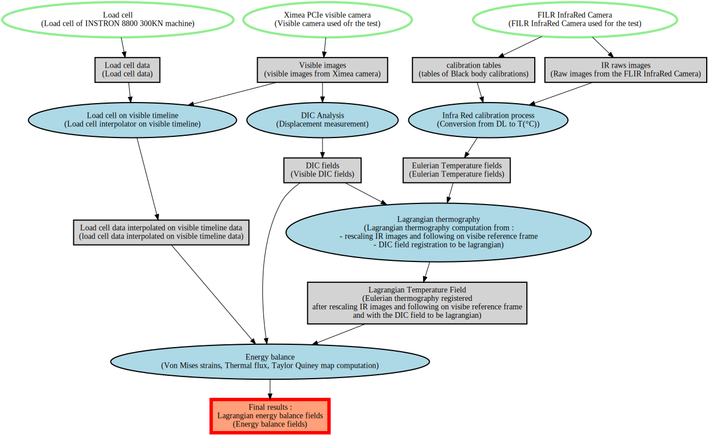

# Qi Hu (LaMcube Ph. D.) case study (IR Lagrangian thermography)

This page documents the **Qi Hu experimental case** and how it maps to R3XA concepts.

## Context
The Qi Hu dataset is a complex experimental pipeline (IR + visible imaging, post‑processing, DIC‑like steps).
For more scientific context, see the Qi Hu thesis (LaMCube): `https://theses.hal.science/tel-04993338`.

## Data flow (conceptual)
**IR camera → raw images → Lagrangian thermography processing → derived fields**  
This is represented as a **directed graph** using:
- `data_sources` (sensors / processing steps)
- `data_sets` (raw and derived data products)
- `input_data_sets` (what a source consumes)
- `data_sources` (what a dataset depends on)

## Graph (Qi Hu example)
Below is the generated SVG graph for the Qi Hu case:



Below is the **interactive HTML** version (PyVis backend):

<iframe
  src="graph_qi_from_scratch.html"
  width="100%"
  height="700"
  style="border:1px solid #ddd;"
  title="Qi Hu data flow graph (interactive)"
></iframe>

## How to generate the graph
The Qi Hu file is built **from scratch in Python** (no input JSON at runtime).
The script uses **loops** for repetitive file lists (IR frames, calibration series, time grids)
so the dataset is defined compactly and remains easy to edit.

To generate the R3XA JSON:
```bash
. .venv/bin/activate
PYTHONPATH=. python examples/python/qi_hu_from_scratch.py
```

Then generate the graph:
```bash
. .venv/bin/activate
python examples/python/graph_r3xa.py \
  --input examples/artifacts/qi_hu_from_scratch.json \
  --output docs/figures/graph_qi_from_scratch
```

This creates:
- `docs/figures/graph_qi_from_scratch.svg` (**Graphviz** backend)
- `docs/figures/graph_qi_from_scratch.html` (**PyVis** backend)

## Graph semantics (colors & shapes)
The graph encodes **object types** and **data‑flow roles**:

### Data sources (ellipses)
- **Initial data sources** (no `input_data_sets`):  
  - **Shape**: ellipse  
  - **Fill**: white  
  - **Border**: light green  
  - **Pen width**: 4
- **Intermediate data sources** (consume datasets via `input_data_sets`):  
  - **Shape**: ellipse  
  - **Fill**: light blue  
  - **Border**: black  
  - **Pen width**: 2

### Data sets (rectangles)
- **Intermediate datasets** (used as input to a later source):  
  - **Shape**: box  
  - **Fill**: light grey  
  - **Border**: black  
  - **Pen width**: 2
- **Final datasets** (not used as input later):  
  - **Shape**: box  
  - **Fill**: salmon `#FFA07A`  
  - **Border**: red  
  - **Pen width**: 6

### Edges
- **Input flow** (`input_data_sets` → data_source): black
- **Output flow** (data_source → data_set): black  

These styles are defined in `examples/python/graph_r3xa.py` and shared across Graphviz and PyVis.

## Files used
- Build script: `examples/python/qi_hu_from_scratch.py`
- Graph tool: `examples/python/graph_r3xa.py`
- Output SVG: `docs/figures/graph_qi_from_scratch.svg`
